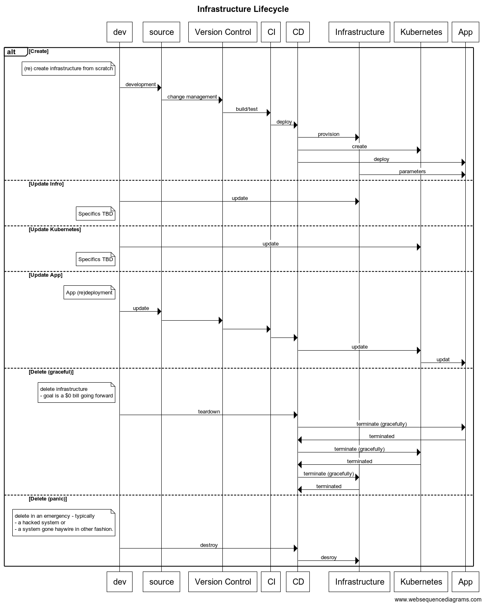
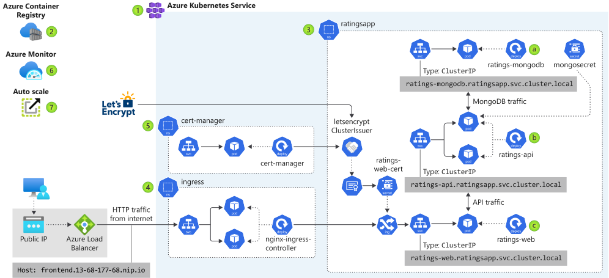

# Azure Kubernetes DevOps

This module documents the various pieces needed to deploy a traditional web app using kubernetes on Azure.

Assumes the app is a traditional 3-tier app:

- front-end: a web client
- back-end: an API service (a nodejs app in this example)
- database: a SQL database server (we presume postgres and that we will use the Azure managed postgres service)

## 0.1 Pre-requisites

Before we can proceed, we will need to ensure the following programs are installed on your system/environment. These are hard to automate reliably
across the various OS', and require you to personally tend to them.

[List of pre-requisites installations](./docs/pre-reqs.md). It's a bit of busy work, but only in aide of making the rest of this exercise smoother. Best of all, we'll wait while you are at it.


Welcome back!

## 0.2 Create the backstage-app

This is likely only needed if restarting the project from scratch. In all likelihood, you are working with an already created app and a `git clone` of
the repo.

For the sake of completeness, if you need to start from scratch, run the following command to create a new backstage-app.

NOTE: If in doubt, select an SQLITE database. We will presume that you selected the postgres database for deployment purposes.

If you are unsure, it's ok to generate the application with a sqlite datastore. Presuming we called the app `bkstg`, this creates a mono-repo with two npm "packages"

```null
bkstg
└── packages
    ├── app       # the front-end/web-ui
    └── backend   # the api server - this connects to a database.
```

`npx @backstage/create-app`

This step does a `yarn install` - which takes a bit to complete.


If you find yourself contemplating the end-of-time, instead consider jumping ahead to the next section.

## Background

This document is targeted at engineers who might be very competent and senior, but are new to the dev-ops landscape, Azure, and Kubernetes. While it is not meant to be a comprehensive tutorial, in a crunch, it should provide enough structure and/or pointers to external resources that will allow you to "get things done" and fill in the blanks later.

### B.1 Cattle Not Pets

A requirement of modern reliable systems is quick recovery from any kind of failure. A recurring meme around this notion is to treat infrastructure and indeed any part of the application itself as ["cattle not pets"](http://cloudscaling.com/blog/cloud-computing/the-history-of-pets-vs-cattle/)

> In the old way of doing things, we treat our servers like pets, for example Bob the mail server. If Bob goes down, it’s all hands on deck. The CEO can’t get his email and it’s the end of the world. In the new way, servers are numbered, like cattle in a herd. For example, www001 to www100. When one server goes down, it’s taken out back, shot, and replaced on the line.

### B.2 Azure Management Scope

When working with Azure, it's important understand how Azure organizes the infrastructure for management, billing and security purposes. While complex setups are probably an overkill here,
it is good to have a bare minimum of understanding, so we'll know where to go look when our needs grow.

[](https://docs.microsoft.com/en-us/azure/cloud-adoption-framework/ready/azure-setup-guide/organize-resources?tabs=AzureManagementGroupsAndHierarchy)

This illustrates the basic structure of Azure's management hierarchy.

- _Management groups_: These groups are containers that help you manage access, policy, and compliance for multiple subscriptions. All subscriptions in a management group automatically inherit the conditions applied to the management group.
- _Subscriptions_: A subscription logically associates user accounts and the resources that were created by those user accounts. Each subscription has limits or quotas on the amount of resources you can create and use. Organizations can use subscriptions to manage costs and the resources that are created by users, teams, or projects.
- _Resource groups_: A resource group is a logical container into which Azure resources like web apps, databases, and storage accounts are deployed and managed.
- _Resources_: Resources are instances of services that you create, like virtual machines, storage, or SQL databases.

In the remainder of this exercise, we will assume that your "Azure login" is bound to a "subscription" with sufficient privileges, and will work creating `resource-groups` and `resources`.

> It's possible that our `yarn install` has completed by this point. Jump ahead to [#]().
> We'll refer you back to this section before it becomes necessary.

### B.3 Kubernetes

Azure provides a [quick introduction to Kubernetes](https://azure.microsoft.com/en-us/topic/what-is-kubernetes/). If you are just getting started with kubernetes, this is a great place to get started.

If you are a seasoned engineer but new to Kubernetes, [Kubernetes Best Practices](https://www.youtube.com/watch?v=wGz_cbtCiEA&list=PLIivdWyY5sqL3xfXz5xJvwzFW_tlQB_GB) the playlist of 7 videos by Sandeep Dinesh from [Google Cloud Tech](https://www.youtube.com/channel/UCJS9pqu9BzkAMNTmzNMNhvg), is excellent. They run a bit over 50 minutes in total, but have
a very high signal to noise ratio. A good investment.

### B.4 Infrastructure as code

[Infrastructure as Code (IaC)](https://docs.microsoft.com/en-us/devops/deliver/what-is-infrastructure-as-code) is the notion of defining infrastructure in a file - typically uderstood to be as a data specification with a bit of embedded logic. Depending on the framework/tooling used, the balance between pure-data and all-code varies. The important part in any case is that the infrastructure is contained in a file and committed to version control.

#### B.4.1 Git-ops/Infrastructure Lifecycle

The general idea is that our applications are traditional 3-tier apps, consisting of a UI, API and DB. We want to deploy the various pieces into a kubernetes cluster, which itself is provisioned over a public cloud (Azure) infrastructure.

The goal is to build Infrastructure as Code (IaC), which allows us to treat as much of the
infrastructure as cattle as possible.

As we shall see in the remainder of this document, a large fraction of the common use-cases, we can accomplish this notion of treating our infrastructure as cattle. What we want really is an ability to create/update/delete/recreate the application and it's necessary infrastructure at will in am automated fashion.

#### B.4.2 GitOps or not to GitOps? That is the question.

We are not yet at the stage of maturity that we can use git-ops in our setup, however,
we cannot escape the general structure of what git-ops mandates. We are just side-stepping
a multitude of additional tools for now. We are re-inventing the wheel here to keep it simple.

The good news is that eventually this will enable an easier path towards a git-ops flow.

We can think of our infrastructure in four layers:

1. Deployed Application - the top layer - the reason we embark on this journey.
2. Configured Infrastructure - the kubernetes layer
3. Provisioned Infrastructure - the services/infrastructure provisioned on the public cloud
4. Bootstrapping script - the script that gets it all going.

Each layer has it's a notion of a life-cycle - especially the operations - Create - Update/Recreate - Delete

Each layers life-cycle operation at a layer typically impacts all layers above it - this is especially true if a delete operation is invoked. However the binding between the layers is
not formalized or explicit in current IaC structures.

This requires our orchestration scripts to maintain this notion of what is possible and
what not. This is done by scripting specific use cases.

Once the infrastructure is created, for the common case of changes to the app-code, we
have the ability to (re)deploy at will. But that is only because we do not make changes to layers 2-4 in the hierarchy described above. If something should change there, it's most likely a destructive recreation of the system.

The rest of this document tries to build the Create & Delete operations for each layer, so
we can provide these in a scripted fashion. While not complete control, it does allow us
to treat our infrastructure as "cattle-not-pets".

The sequence diagram below pulls together the various actors into a single inter-dependent flow
and layers on the various operations.


Note that while we indicate the notion of updates to the kubernetes cluster and the underlying infrastructure, this is currently not addressed as part of this exercise.

## Infrastructure Design

We now have an application to deploy, and a basic requirement that we are going to deploy
the application over a kubernetes cluster on the Azure cloud. We also have a basic understanding of a concepts and pieces involved.

So with that, let's get started.

We will be adapting the [AKS workshop architecture](https://docs.microsoft.com/en-us/learn/modules/aks-workshop/01-introduction) to fit our needs. Specifically, there are two changes we anticipate

1. replacing `mongo-db` within the kubernetes cluster with an _Azure Managed Postgres_ instance
2. [TBD] adding an _Azure Key Vault_ to manage secrets (db credentials mainly)

Instead of building things up one step at a time, we will assume that the architecture works
and build for the final goal. Meaning, our script will not piece-meal the building to aide understanding. Please read/implement the workshop tutorial to gain that understanding.



At some point in the future, we hope to incorporate as much of the security and governance capabilities as appropriate. The [Security and Governance workshop](https://github.com/Azure/sg-aks-workshop) will serve as a starting point for that exercise. The link is only provided here for (future) reference.

### 1. Infrastructure/Configuration inventory

These are the pieces that we'll need to provision/configure as part of our script.
They are also split up by stage of creation, allowing us automate with clear separation
of responsibility.

| Layer     | Azure                   | Kubernetes                  |
| --------- | ----------------------- | --------------------------- |
| bootstrap | resource-group          |                             |
|           | service-principal       |                             |
| infra     | azure-networking        |                             |
|           | AKS-cluster             |                             |
|           | ACR                     |                             |
|           | bind AKS-ACR            |                             |
|           | Azure-postgres          |                             |
|           | log-analytics workspace |                             |
|           | AKS monitoring addon    |                             |
| config    |                         | namespace                   |
|           |                         | api-Deployment              |
|           |                         | api-Service                 |
|           |                         | LoadBalancer                |
|           |                         | ui-Deployment               |
|           |                         | ui-Service                  |
|           |                         | ingress                     |
|           |                         | cert-manager                |
|           |                         | ClusterRole(monitoring)     |
|           |                         | api-HorizontalPodAutoscaler |

## 2. Run Script

As with any automation, the point here is to have an ability to apply the general template being developed here to fit other needs.

Other needs could include deploying

- the same application to different environments (dev/test/production etc)
- the same application to different regions
- and even different applications using the same template

> Further, we will use [`doable`](https://github.com/acuity-sr/doable) to extract these into self contained scripts, making this an executable document!

We will be developing a create script that does each step in sequence, defining any needed environment variables as we go along.

### Globals

The absolute minimal set of values to be configured by the user before we can generate the rest of the scripts are stored in a
`globals.{bat|sh}` file.

- `windows` (create globals.bat)

```bat globals.bat
rem globals
set GH_ORG=acuity-sr
set GH_REPO=acuity-bkstg
set REGION_NAME=eastus
set STAGE=dev

rem customize if you want the app-name to be different
set APP_NAME=%GH_REPO%-%STAGE%-%REGION%

pushd %~dp0
set SCRIPT_ROOT=%CD%
popd
SRC_DIR=%SCRIPT_DIR%/..
```

- `*nix` (create globals.sh)

```sh globals.sh
# globals
GH_ORG=acuity-sr
GH_REPO=acuity-bkstg
REGION_NAME=eastus
STAGE=dev

# possibly customize
APP_NAME=$GH_REPO-$STAGE-$REGION

SCRIPT_ROOT="$( cd "$( dirname "${BASH_SOURCE[0]}" )" &> /dev/null && pwd )"
SRC_DIR=$SCRIPT_ROOT/..
```

- `windows` (creates win/run.bat)

```bat win/run.bat

rem initialize script dir (via https://stackoverflow.com/a/36351656)
pushd %~dp0
set SCRIPT_DIR=%CD%
popd

rem bootstrap
set GH_ORG=acuity-sr
set APP_NAME=acuity-bkstg
set SRC_DIR=../acuity-bkstg
set REGION_NAME=eastus
set RESOURCE_GROUP=%APP_NAME%-rg
call %SCRIPT_DIR%\bootstrap.bat

rem build
rem we use a build_app.bat in-lieu of a CI process when working locally
set GIT_REPO=https://github.com/$GH_ORG/$APP_NAME
set API_DIR=packages/backend
set UI_DIR=packages/frontend
call %SCRIPT_DIR%\build_app.bat

rem infra
call %SCRIPT_DIR%\create_infra.bat


rem config

call %SCRIPT_DIR%\create_kubernetes.bat

rem app

call %SCRIPT_DIR%\deploy_app.bat

```

- `*nix` (creates nix/run.sh)

```sh nix/run.sh

SCRIPT_DIR="$( cd "$( dirname "${BASH_SOURCE[0]}" )" &> /dev/null && pwd )"

# bootstrap
GH_ORG=acuity-sr
APP_NAME=acuity-bkstg
REGION_NAME=eastus
RESOURCE_GROUP=$APP_NAME-rg
. $SCRIPT_DIR/bootstrap.sh

# # build
# # we use a build_app.sh in-lieu of a CI process when working locally
# GIT_REPO=https://github.com/$GH_ORG/$APP_NAME
# API_DIR=packages/backend
# UI_DIR=packages/frontend
# . $SCRIPT_DIR/build_app.sh

# infra
SUBNET_NAME=$APP_NAME-aks-subnet
VNET_NAME=$APP_NAME-aks-vnet
. $SCRIPT_DIR/create_infra.sh

# # config
# . $SCRIPT_DIR/create_kubernetes.sh

# # app
# . $SCRIPT_DIR/deploy_app.bat

```

## 3. Bootstrap

### 3.1 Subscription ID

As we explored in the section on Azure Management Hierarchies, each Azure deployment is contained within a "subscription". Subscriptions are a logical partition, allowing billing and management control. Creating a subscription is beyond the scope of this document, however, by having a personal login to the Azure cloud, you are working within the purview of a "subscription". At a minimum, it has a clearly defined party to be billed for resources consumed. This could be an employer or your personal credit card used to setup the Azure account.

While we do not create it, we do need the subscription id to create a Resource Group, which
will in turn contain all the resources we consume.

The subscription ID can vary by login. While it's possible (even preferable) to hard code this value for a team, when running this script on your local machine, this will likely vary.

The bootstrap script automates it's extraction - after you have logged via the azure CLI.

- `windows` (creates win/bootstrap.bat)

```bat win/bootstrap.bat

echo "\n\n****************"
echo "1. Bootstrapping"
echo "****************\n\n"

rem specify SUBSCRIPTION_ID here if you'd like to pin it to a specific one.
rem by default, will ask you to login and use the SUBSCRIPTION_ID tied to your account
set SUBSCRIPTION_ID=

if (%SUBSCRIPTION_ID% == '') (
  echo "Extracting Azure 'Subscription ID' from current login"
  rem Opens a webpage to login to Azure and provides credentials to the azure-cli
  az login

  rem Picks the subscription tied to the login above
  rem az account show --query id --output tsv
  FOR /F "tokens=* USEBACKQ" %%g IN (`az account show --query id --output tsv`) do (SET SUBSCRIPTION_ID=%%g)

)
echo SUBSCRIPTION_ID=%SUBSCRIPTION_ID%

```

- `*nix` (creates nix/bootstrap.sh)

```sh nix/bootstrap.sh

echo "\n\n****************"
echo "1. Bootstrapping"
echo "****************\n\n"

# specify SUBSCRIPTION_ID here if you'd like to pin it to a specific one.
# by default, will ask you to login and use the SUBSCRIPTION_ID tied to your account
SUBSCRIPTION_ID=
if [[ SUBSCRIPTION_ID == '' ]]
then
  echo "Extracting Azure 'Subscription ID' from current login"

  # Opens a webpage to login to Azure and provides credentials to the azure-cli
  az login

  # Picks the subscription tied to the login above
  # az account show --query id --output tsv
  SUBSCRIPTION_ID=`az account show --query id --output tsv`
fi
echo "SUBSCRIPTION_ID=$SUBSCRIPTION_ID"
```

### 3.2 Resource Group

- `windows` (appends to win/bootstrap.bat)

```bat win/bootstrap.bat

echo "Create resource group if it doesn't exist"
FOR /F "tokens=* USEBACKQ" %%g IN (`az group exists -n %RESOURCE_GROUP%`) do (SET rgExists=%%g)

if (%rgExists%=='false') (
  echo "Creating resource-group '%RESOURCE_GROUP%'"
  az group create \
    --name %RESOURCE_GROUP% \
    --location %REGION_NAME%
) else (
  echo "Reusing existing resource group '$RESOURCE_GROUP'"
)
FOR /F "tokens=* USEBACKQ" %%g IN (`az group show --query 'id' -n %RESOURCE_GROUP%`) do (SET RESOURCE_GROUP_ID=%%g)

```

- `*nix` (appends to nix/bootstrap.sh)

```sh nix/bootstrap.sh

echo "Create resource group if it doesn't exist"
rgExists=`az group exists -n $RESOURCE_GROUP`
if [ $? -eq 0 ];
then
  echo "Reusing existing resource group '$RESOURCE_GROUP'"
else
  echo "Creating resource-group '$RESOURCE_GROUP'"
  az group create \
    --name $RESOURCE_GROUP \
    --location $REGION_NAME
fi

RESOURCE_GROUP_ID=$(az group show --query 'id' -n $RESOURCE_GROUP)

```

### 3.3 Azure Active Directory Application

We need a service principal to generate credentials for automation to access necessary resources.
However, before you create a service principal, you need to create an “application” in Azure Active Directory. You can think of this as an identity for the application that needs access to your Azure resources.

- `windows` (appends to win/bootstrap.bat)

```bat win/bootstrap.bat

echo "Create Active Directory App if not already existing"

rem fetch previously created app
FOR /F "tokens=* USEBACKQ" %%g IN (`az ad app list --query [].appId -o tsv --display-name %APP_NAME%`) do (SET APP_ID=%%g)

if (%APP_ID%=="") (
  rem APP_ID not found, create new Active directory app
  az ad app create --display-name %APP_NAME%
  echo "created new App '%APP_NAME%'"
)

rem extract APP_ID (needed to create the service principal)
FOR /F "tokens=* USEBACKQ" %%g IN (`az ad app list --query [].appId -o tsv --display-name %APP_NAME%`) do (SET APP_ID=%%g)

echo "APP_ID=%APP_ID%"
```

- `*nix` (appends to nix/bootstrap.sh)

```sh nix/bootstrap.sh

echo "Create Active Directory App if not already existing"

# fetch previously created app
APP_ID=$(az ad app list --query [].appId -o tsv --display-name $APP_NAME)

if [ $? -ne 0 ];
then
  # APP_ID not found, create new Active directory app
  az ad app create --display-name $APP_NAME
  echo "created new App '$APP_NAME'"
fi

# extract APP_ID (needed to create the service principal)
APP_ID=`az ad app list --query [].appId -o tsv --display-name $APP_NAME`
echo "APP_ID=$APP_ID"

```

### 3.3 Service Principal

With subscription id in hand, we are now in a position to create our service principal.

A [service principal](https://docs.microsoft.com/en-us/cli/azure/create-an-azure-service-principal-azure-cli?toc=%2Fazure%2Fazure-resource-manager%2Ftoc.json&view=azure-cli-latest) provides authentication for automation/non-human entities. We can assign a "role" with specific access privileges or "Role based access control (RBAC)".

Creation of the service principal returns the authenticatin credentials. We will sore these to a file, allowing us to use this to setup secrets for github actions.

> NOTE: It seems managed identities might be a better way to provide RBAC privileges. However we are unclear as to the final set of resources needed and whether all resources required will support Managed identities. A move to managed identities will need to be investigated and done at a later point in time.

- `windows` (appends to win/bootstrap.bat)

```bat win/bootstrap.bat

rem initialize script dir (via https://stackoverflow.com/a/36351656)
pushd %~dp0
set SCRIPT_DIR=%CD%
popd


set SERVICE_PRINCIPAL=%APP_NAME%-sp
set SP_FNAME=./%APP_NAME%-sp-creds.dat
rem create service principal
if exist %SP_FNAME% (
  echo "Reusing existing service principal %APP_NAME%-sp"
  node %SCRIPT_DIR%/../bin/decrypt.js %SP_FNAME%
  FOR /F "tokens=* USEBACKQ" %%g IN (`type %SP_FNAME%.decrypted`) do (SET SP_CREDENTIALS=%%g)
  rm %SP_FNAME%.decrypted
) else (
  FOR /F "tokens=* USEBACKQ" %%g IN (`\
    az ad sp create-for-rbac \
      --sdk-auth \
      --skip-assignment \
      --name %SERVICE_PRINCIPAL%`) do (SET SP_CREDENTIALS=%%g)
  echo %SP_CREDENTIALS% > %SP_FNAME%
  node %SCRIPT_DIR%/../bin/encrypt.js %SP_FNAME%
)
FOR /F "tokens=* USEBACKQ" %%g IN (`az ad sp list --query '[].objectId' -o tsv --display-name %SERVICE_PRINCIPAL%`) do (SET SERVICE_PRINCIPAL_ID=%%g)

```

- `*nix` (appends to nix/bootstrap.sh)

```sh nix/bootstrap.sh

SCRIPT_DIR="$( cd "$( dirname "${BASH_SOURCE[0]}" )" &> /dev/null && pwd )"

SERVICE_PRINCIPAL="$APP_NAME-sp"
SP_FNAME="./$APP_NAME-sp-creds.dat"
if test -f $SP_FNAME
then
  node $SCRIPT_DIR/../bin/decrypt.js $SP_FNAME
  SP_CREDENTIALS=`cat $SP_FNAME.decrypted`
  rm $SP_FNAME.decrypted
else
  SP_CREDENTIALS=`
  az ad sp create-for-rbac \
    --sdk-auth \
    --skip-assignment\
    --name $SERVICE_PRINCIPAL`
  echo $SP_CREDENTIALS > $SP_FNAME
  node $SCRIPT_DIR/../bin/encrypt.js $SP_FNAME
fi

SERVICE_PRINCIPAL_ID=$(az ad sp list --query '[].objectId' -o tsv --display-name $SERVICE_PRINCIPAL)

```

## 4. Build

- `windows` (creates win/app_build.bat)

```bat win/app_build.bat

```

- `*nix` (creates nix/app_build.sh)

```sh nix/app_build.sh

```

## 5. Provisioning Infrastructure

### 5.1 Provision Networking

Provision a virtual network, using Azure Container Networking Interface (CNI).

- `windows` (creates win/create_infra.bat)

```bat win/create_infra.bat

echo "\n\n******************************"
echo "2. Provisioning infrastructure"
echo "******************************\n\n"

set SUBNET_NAME=%APP_NAME%-aks-subnet
set VNET_NAME=%APP_NAME%-aks-vnet

rem check to see if previously created
FOR /F "tokens=* USEBACKQ" %%g IN (`az network vnet subnet show \
    --resource-group %RESOURCE_GROUP% \
    --vnet-name %VNET_NAME% \
    --name %SUBNET_NAME% \
    --query id -o tsv`) do (SET SUBNET_ID=%%g)

if ( SUBNET_ID == '') (
  echo "Creating virtual network '%VNET_NAME%' and subnet '%SUBNET_NAME%'"
  az network vnet create \
    --resource-group %RESOURCE_GROUP% \
    --location %REGION_NAME% \
    --name %VNET_NAME% \
    --address-prefixes 10.0.0.0/8 \
    --subnet-name %SUBNET_NAME% \
    --subnet-prefixes 10.240.0.0/16
) else (
  echo "Reusing virtual network '%VNET_NAME%' and subnet '%SUBNET_NAME%'"
)

FOR /F "tokens=* USEBACKQ" %%g IN (`az network vnet subnet show \
    --resource-group %RESOURCE_GROUP% \
    --vnet-name %VNET_NAME% \
    --name %SUBNET_NAME% \
    --query id -o tsv`) do (SET SUBNET_ID=%%g)
```

- `*nix` (creates nix/create_infra.sh)

```sh nix/create_infra.sh

echo "\n\n******************************"
echo "2. Provisioning infrastructure"
echo "******************************\n\n"

SUBNET_NAME=$APP_NAME-aks-subnet
VNET_NAME=$APP_NAME-aks-vnet

# check to see if previously created
SUBNET_ID=$(az network vnet subnet show \
    --resource-group $RESOURCE_GROUP \
    --vnet-name $VNET_NAME \
    --name $SUBNET_NAME \
    --query id -o tsv)

if [ $? -eq 0 ];
then
  echo "Reusing virtual network '$VNET_NAME' and subnet '$SUBNET_NAME'"
else
  echo "Creating virtual network '$VNET_NAME' and subnet '$SUBNET_NAME'"
  TMP=$(az network vnet create \
    --resource-group $RESOURCE_GROUP \
    --location $REGION_NAME \
    --name $VNET_NAME \
    --address-prefixes 10.0.0.0/8 \
    --subnet-name $SUBNET_NAME \
    --subnet-prefixes 10.240.0.0/16)
fi

SUBNET_ID=$(az network vnet subnet show \
    --resource-group $RESOURCE_GROUP \
    --vnet-name $VNET_NAME \
    --name $SUBNET_NAME \
    --query id -o tsv)

echo SUBNET_ID=$SUBNET_ID

```

### 5.2 Provision AKS

- `windows` (creates win/create_infra.bat)

```bat win/create_infra.bat

FOR /F "tokens=* USEBACKQ" %%g IN (`az aks get-versions \
    --location %REGION_NAME% \
    --query 'orchestrators[?!isPreview] | [-1].orchestratorVersion' \
    --output tsv`) do (SET VERSION=%%g)

set AKS_CLUSTER_NAME=%APP_NAME%-%STAGE%-aks

FOR /F "tokens=* USEBACKQ" %%g IN (`az aks create \
  --resource-group %RESOURCE_GROUP% \
  --name %AKS_CLUSTER_NAME% \
  --vm-set-type VirtualMachineScaleSets \
  --node-count 2 \
  --load-balancer-sku standard \
  --location %REGION_NAME% \
  --kubernetes-version %VERSION% \
  --network-plugin azure \
  --vnet-subnet-id %SUBNET_ID% \
  --service-cidr 10.2.0.0/24 \
  --dns-service-ip 10.2.0.10 \
  --docker-bridge-address 172.17.0.1/16 \
  --generate-ssh-keys`) do (SET AKS_CLUSTER=%%g)

```

- `*nix` (creates nix/create_infra.sh)

```sh nix/create_infra.sh

VERSION=$(az aks get-versions \
    --location $REGION_NAME \
    --query 'orchestrators[?!isPreview] | [-1].orchestratorVersion' \
    --output tsv)

AKS_CLUSTER_NAME=$APP_NAME-$STAGE-aks

AKS_CLUSTER =$(az aks create \
  --resource-group $RESOURCE_GROUP \
  --name $AKS_CLUSTER_NAME \
  --vm-set-type VirtualMachineScaleSets \
  --node-count 2 \
  --load-balancer-sku standard \
  --location $REGION_NAME \
  --kubernetes-version $VERSION \
  --network-plugin azure \
  --vnet-subnet-id $SUBNET_ID \
  --service-cidr 10.2.0.0/24 \
  --dns-service-ip 10.2.0.10 \
  --docker-bridge-address 172.17.0.1/16 \
  --generate-ssh-keys)

```

- `windows` (creates win/create_infra.bat)

```bat win/create_infra.bat

```

- `*nix` (creates nix/create_infra.sh)

```sh nix/create_infra.sh

```

- `windows` (creates win/create_infra.bat)

```bat win/create_infra.bat

```

- `*nix` (creates nix/create_infra.sh)

```sh nix/create_infra.sh

```

## 6. Config

### 6.1 Create

- `windows` (creates win/create_kubernetes.bat)

```bat win/create_kubernetes.bat

```

- `*nix` (creates nix/create_kubernetes.sh)

```sh nix/create_kubernetes.sh

```

### 6.2 Api

#### 6.2.1 Deployment

- creates api-deployment.yml

```yaml api-deployment.yml

```

#### 6.2.2 Service

- creates api-service.yml

```yml api-service.yml

```

### 6.3 UI

#### 6.3.1 Deployment

- creates ui-deployment.yml

```yml ui-deployment.yml

```

#### 6.3.2 Service

- creates ui-service.yml

```yml ui-service.yml

```

## 7. Deploy

- `windows` (creates win/app_deploy.bat)

```bat win/app_deploy.bat

```

- `*nix` (creates nix/app_deploy.sh)

```sh nix/app_deploy.sh

```

## 8 Destroy

This is a brute force mechanism of destroying the resource-group and all associated resources.
For the moment, it's meant to reduce biulling to $0 and meant for use in development.

> WARNING: Significant caution in using this for any live system advised. This can cause serious disruption to any live service - recovery might not be possible, data-loss is very very likely.

- `windows` (creates win/destroy.bat)

```bat win/destroy.bat

rem initialize script dir (via https://stackoverflow.com/a/36351656)
pushd %~dp0
set SCRIPT_DIR=%CD%
popd

rem bootstrap
set APP_NAME=acuity-bkstg
set REGION_NAME=eastus
set RESOURCE_GROUP=%APP_NAME%-rg
call %SCRIPT_DIR%\bootstrap.bat

az group delete --resource-group %RESOURCE_GROUP% --no-wait

```

- `*nix` (creates nix/destroy.sh)

```sh nix/destroy.sh

SCRIPT_DIR="$( cd "$( dirname "${BASH_SOURCE[0]}" )" &> /dev/null && pwd )"
. $SCRIPT_DIR/bootstrap.sh

az group delete --resource-group %RESOURCE_GROUP% --no-wait
az ad app delete --id $APP_ID
az ad sp delete
```

## TODO

These are a list of enhancements to be worked upon in next iterations

- [ ] Constrain `Service Principal` access
- [ ] Use `Managed Identities`?
- [ ] `Azure Key Vault` to store secrets
- [ ] `terraform`` for infrastructure specification and deployment
